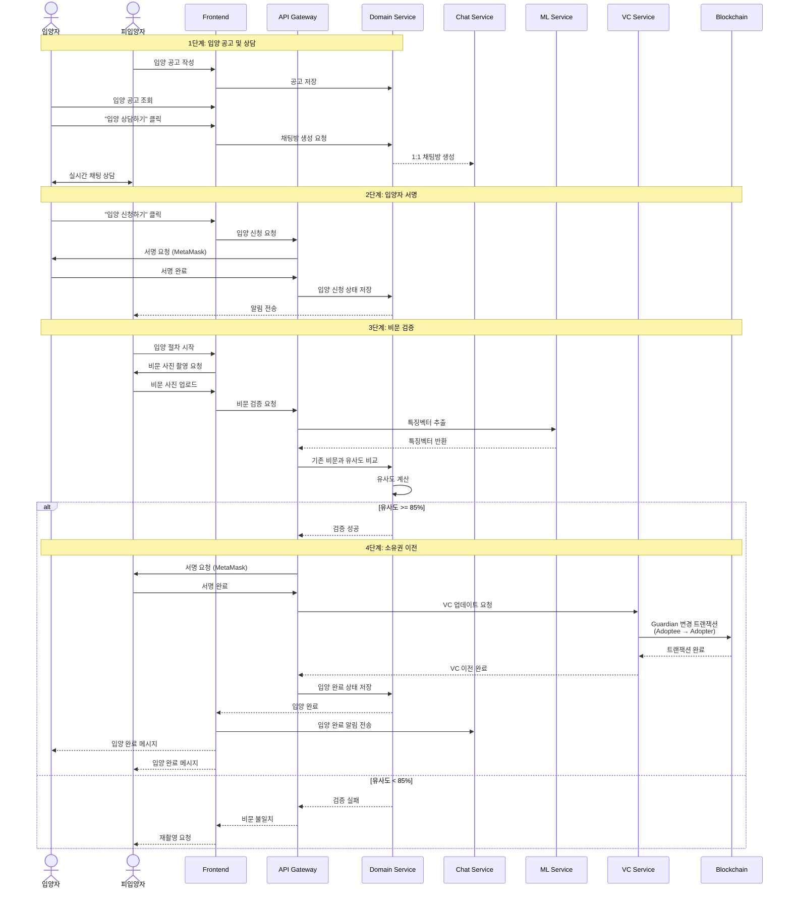

# 멍멍Paw 

**한 마리의 유기견도 잊히지 않도록**  
DID를 통해 유기견의 존재를 기록하고 입양과 후원을 연결하는 웹 플랫폼

---

## 목차

- [프로젝트 소개](#-프로젝트-소개)
- [주요 기능](#-주요-기능)
- [시연 영상](#-시연-영상)
- [기술 스택](#-기술-스택)
- [시스템 아키텍처](#-시스템-아키텍처)
- [주요 플로우](#-주요-플로우)
- [데이터베이스 설계](#-데이터베이스-설계)
- [팀 소개](#-팀-소개)

---

## 프로젝트 소개

### 배경

반려동물 산업이 성장하는 이면에는 여전히 **매년 10만 마리 이상의 유기견**이 발생하고, 그중 약 **2만여 마리(18.5%)가 안락사** 되는 현실이 있습니다.

### 문제점

- **신원 미등록**: 유기동물은 고유한 식별번호 없이 '기록되지 않은 존재'로 남음
- **높은 입양 진입장벽**: 제한적인 정보와 불편한 입양 절차
- **보호소 재정 부족**: 수용 한계와 관리 비용 문제로 인한 안락사

### 솔루션

멍멍Paw는 **DID(Decentralized Identifier) 기술**과 **블록체인**을 활용하여:

1. **유기견 비문을 통한 고유 신원 부여**
2. **실시간 채팅과 입양 후기로 입양 접근성 향상**
3. **자체 화폐(뼈다귀)를 통한 충전식 후원 시스템**

---

## 주요 기능

### 1. DID 기반 신원 관리
- 비문(코 지문) 인식을 통한 고유 DID 생성
- 블록체인에 영구 기록되는 투명한 신원 시스템
- Self-Sovereign Identity 방식의 VC/VP 관리

### 2. 입양 플랫폼
- 실시간 채팅을 통한 입양 상담
- 스토리 기능으로 유기견 일상 공유
- 블록체인 기반 투명한 소유권 이전

### 3. 후원 시스템
- 자체 화폐 '뼈다귀' (1뼈다귀 = 1,000원)
- 토스 페이먼츠 연동 간편 결제
- 후원자 내역 익명 공개

### 4. 입양 후기 & 스토리
- 입양 완료 후 입양 후기 경험 공유
- 일상 콘텐츠를 통한 유대감 형성
- 커뮤니티 기반 소통

---

## 시연 영상

### 1️회원가입 및 로그인

### 2️둘러보기 및 후원

### 3️반려동물 등록 및 채팅, 입양

---

## 기술 스택

### Frontend

### Backend

### Blockchain & DID

### Database

### AI/ML

### Infrastructure

---

## 시스템 아키텍처

<!-- 아키텍처 이미지를 여기에 추가하세요 -->

### 아키텍처 특징

- **마이크로서비스 아키텍처**: 각 도메인별 독립적인 서비스 구성
- **gRPC 통신**: 서비스 간 고성능 통신으로 응답 속도 향상
- **프라이빗 블록체인**: 3-node QBFT 합의 알고리즘 기반 Hyperledger Besu
- **CI/CD 자동화**: NCP SourcePipeline 기반 자동 빌드 및 배포

### 주요 컴포넌트

#### 1. Ingress Controller (NCP Kubernetes)
- **dogdogpaw Ingress**: 프론트엔드(/) 및 API Gateway(/api) 라우팅
- **besu Ingress**: 블록체인 노드 RPC 로드밸런싱

#### 2. API Gateway (NestJS)
- 모든 클라이언트 요청의 단일 진입점
- JWT 토큰 관리 및 DID 검증
- gRPC ↔ HTTP 프로토콜 변환
- 서비스 간 라우팅 및 인증/인가

#### 3. Service Layer

| 서비스 | 기술 스택 | 역할 |
|--------|-----------|------|
| **Domain Service** | Spring Boot | 입양, 후원, 채팅 등 핵심 비즈니스 로직 |
| **VC Service** | NestJS | DID/VC 발급, 검증 및 관리 |
| **Indexer Service** | Golang | 블록체인 이벤트 수집 및 동기화 |
| **ML Service** | FastAPI | 비문 특징벡터 추출 및 유사도 판별 |
| **Faucet Service** | NestJS | 테스트 토큰 발급 |

#### 4. Blockchain Network
- **Hyperledger Besu**: 프라이빗 네트워크
- **합의 알고리즘**: QBFT (Byzantine Fault Tolerant)
- **노드 구성**: 3-node 클러스터
- **스마트 컨트랙트**:
  - `PetDID Contract`: 반려동물 DID 관리
  - `Guardian Contract`: 보호자-반려동물 관계 관리

#### 5. Database
- **MySQL**: 도메인 데이터 (입양, 후원, 채팅 등)
- **PostgreSQL**: DID/VC 데이터, 블록체인 이벤트
- **Redis**: JWT 토큰, 캐시, Pub/Sub 메시지큐

---

## 주요 플로우

### 1. 회원가입 플로우
**회원가입 프로세스:**
1. MetaMask 지갑 연결 및 주소 획득
2. 이메일 인증
3. 개인정보 입력 후 MetaMask 서명
4. 개인정보 해시 + 지갑주소 블록체인 등록
5. 사용자 DID 생성 완료

---

### 2. 로그인 플로우
**로그인 프로세스:**
1. MetaMask 지갑 연결
2. 지갑 주소로 사용자 조회
3. VP(Verifiable Presentation) 생성 요청
4. MetaMask 서명 후 VP 발급 (JWT 형식)
5. JWT 토큰 저장 (1 VP = 1 Session)

---

### 3. 펫 등록 플로우
**펫 등록 프로세스:**
1. 로그인 상태 확인 (JWT 토큰)
2. 펫 기본 정보 입력
3. 비문 사진 촬영 및 업로드
4. AI 모델로 특징벡터 추출 (Siamese Network)
5. 기존 비문 중복 체크
6. 특징벡터 해시로 DID 생성
7. MetaMask 서명 후 VC 발급
8. 블록체인에 트랜잭션 기록
9. Indexer가 이벤트 수집 및 DB 동기화

---

### 4. 펫 이전 (입양) 플로우
**입양 프로세스:**

<!--#### 1단계: 입양 공고 및 상담
- 피입양자(분양자)가 입양 공고 작성
- 입양자가 "입양 상담하기" 클릭
- 1:1 실시간 채팅방 생성
- 채팅을 통한 입양 상담

#### 2단계: 입양 신청 (입양자 서명)
- 입양자가 "입양 신청하기" 클릭
- MetaMask 서명 요청 및 완료
- 입양 신청 상태 저장
- 피입양자에게 알림 전송

#### 3단계: 비문 검증
- 피입양자가 입양 절차 시작
- 펫의 비문 사진 촬영
- AI 모델로 특징벡터 추출
- 기존 등록된 비문과 유사도 비교
- **유사도 85% 이상** 통과 기준

#### 4단계: 소유권 이전
- 유사도 검증 성공 시
- 피입양자 MetaMask 서명
- 블록체인에 Guardian 변경 트랜잭션
  - Guardian: `피입양자 → 입양자`
- VC 소유권 이전
- 입양 완료 상태로 변경
- 채팅방에 입양 완료 알림

**다음 로그인부터:**
- 입양자가 해당 펫의 VC를 포함한 VP 발급 가능
- 입양자가 펫의 새로운 보호자로 인증됨
-->
---

## 데이터베이스 설계

### ERD (Entity Relationship Diagram)

<!--### 주요 테이블 설명

#### 1. USERS (사용자)
- **역할**: 회원 정보 관리
- **주요 컬럼**:
  - `wallet_address`: MetaMask 지갑 주소 (Unique)
  - `email`: 이메일 (Unique)
  - `role`: 사용자 역할 (일반 사용자, 보호소 관리자)
- **특징**: 지갑 주소 기반 인증, DID Holder

#### 2. PETS (반려동물)
- **역할**: 반려동물 정보 관리
- **주요 컬럼**:
  - `did`: 반려동물 고유 DID (Unique)
  - `owner_id`: 현재 보호자 (FK → USERS)
  - `noseprint_hash`: 비문 특징벡터 해시
- **특징**: DID와 1:1 매핑, 비문 기반 신원 확인

#### 3. DID_RECORDS (DID 기록)
- **역할**: 블록체인 DID 이력 관리
- **주요 컬럼**:
  - `did`: DID 주소 (Unique)
  - `pet_id`: 반려동물 ID (FK → PETS)
  - `vc_json`: Verifiable Credential JSON
  - `blockchain_tx_hash`: 블록체인 트랜잭션 해시
- **특징**: VC 저장, 블록체인 연동 이력

#### 4. ADOPTION_POSTS (입양 공고)
- **역할**: 입양 공고 관리
- **주요 컬럼**:
  - `pet_id`: 입양 대상 펫 (FK → PETS)
  - `author_id`: 작성자 (FK → USERS)
  - `status`: 공고 상태 (진행중, 완료, 취소)
  - `deadline`: 마감일
- **특징**: 펫 1마리당 1개의 공고

#### 5. DONATION_POSTS (후원 공고)
- **역할**: 후원 요청 관리
- **주요 컬럼**:
  - `category`: 후원 카테고리 (수술비, 치료비, 사료비, 시설비)
  - `target_amount`: 목표 금액 (뼈다귀)
  - `current_amount`: 현재 모금액 (뼈다귀)
- **특징**: 투명한 후원금 관리, 뼈다귀 단위

#### 6. STORIES (일상 스토리)
- **역할**: 반려동물 일상 공유
- **주요 컬럼**:
  - `pet_id`: 대상 펫 (FK → PETS)
  - `author_id`: 작성자 (FK → USERS)
  - `likes_count`: 좋아요 수
- **특징**: 커뮤니티 소통, 입양 전 친밀감 형성

#### 7. REVIEWS (입양 후기)
- **역할**: 입양 완료 후 경험 공유
- **주요 컬럼**:
  - `pet_id`: 입양한 펫 (FK → PETS)
  - `author_id`: 작성자 (FK → USERS)
- **특징**: 멍멍Paw에서 입양 완료한 경우만 작성 가능

#### 8. CHAT_ROOMS (채팅방)
- **역할**: 입양 상담 채팅방 관리
- **주요 컬럼**:
  - `adoption_post_id`: 입양 공고 (FK → ADOPTION_POSTS)
  - `adopter_id`: 입양자 (FK → USERS)
  - `adoptee_id`: 피입양자 (FK → USERS)
  - `status`: 채팅방 상태
- **특징**: 1:1 실시간 채팅, 입양 절차 진행

#### 9. MESSAGES (채팅 메시지)
- **역할**: 채팅 메시지 저장
- **주요 컬럼**:
  - `chat_room_id`: 채팅방 (FK → CHAT_ROOMS)
  - `sender_id`: 발신자 (FK → USERS)
  - `content`: 메시지 내용
- **특징**: Redis Pub/Sub를 통한 실시간 전송

---

## 추가 문서

- [API 문서](./docs/API.md)
- [스마트 컨트랙트](./docs/CONTRACTS.md)
- [배포 가이드](./docs/DEPLOYMENT.md)
- [개발 환경 설정](./docs/SETUP.md)
-->

---

## 👥 팀 소개

### 팀명: 더워멍냥

| 이름 | 역할 | 소속 | 이메일 | GitHub |
|------|------|------|--------|--------|
| 모진영 | 팀장, 풀스택 개발 | 상명대학교 | ahwlsqja1324@gmail.com | [@ahwlsdud](링크) |
| 신윤진 | 백엔드 개발 | 상명대학교 | yj001shin@naver.com | [@nomad1jin](https://github.com/nomad1jin) |
| 박수현 | 프론트엔드 개발 | 상명대학교 | tngus092112@gmail.com | [@onion](링크) |

---

## 공모전 

- **제9회 K-PaaS 활용 공모전** - 서비스 개발 부문 출품 (2025.10.31)

---

<!--## 라이선스

이 프로젝트는 MIT 라이선스 하에 배포됩니다. 자세한 내용은 [LICENSE](LICENSE) 파일을 참조하세요.

-->

## 문의

프로젝트에 대한 문의사항이 있으시면 아래로 연락주세요:
- Email: ahwlsqja1324@gmail.com
- Website: http://puppypaw.site/

---

**Made with by Team 더워멍냥**

